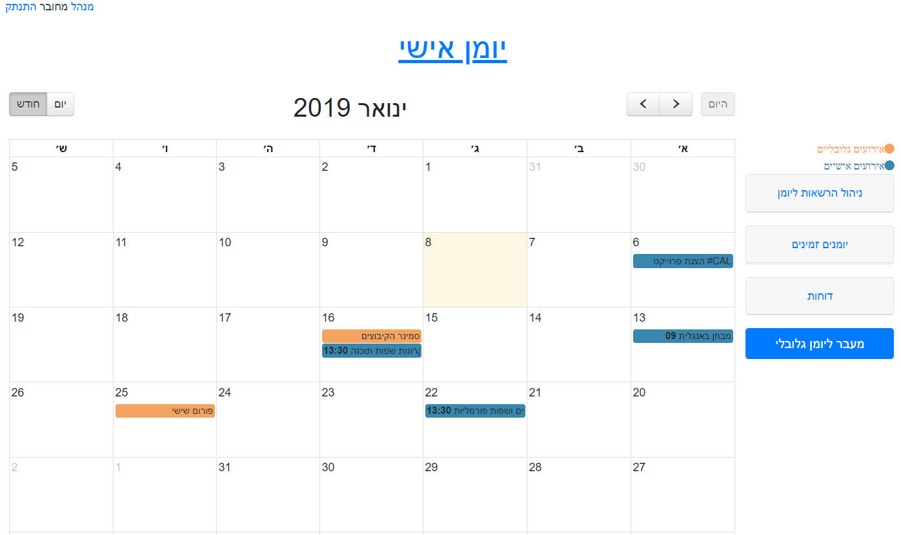

# HashtagCal Project Group 20
> This project displays a calendar web site

[![NPM Version][npm-image]][npm-url]
[![Build Status][travis-image]][travis-url]
[![Downloads Stats][npm-downloads]][npm-url]

An amazing calendar that offers options such as:<br>
Register / Login to the site which includes 3 user types<br>
Manage user events in daily / monthly view<br>
Issuing user reports<br>
Grant permissions to a calendar for another user<br>
Managing a global calendar by editors (user type)<br>
Issuing content editor reports<br>
Manage manager requests to register / edit events<br>
Issuing Manager Reports<br>
Editing users<br>
And more ...



## Installation

Backend:

```sh
bcrypt: ^3.0.3
body-parser: ^1.18.3
cors: ^2.8.5
express: ^4.16.4
express-validator: ^5.3.0
jsonwebtoken: ^8.4.0
mongoose: ^5.3.13
```

Frontend-CSS:
```sh
Bootstrap: ^4.0.0
FullCalendar: ^3.9.0
jQuery UI: ^1.12.1
toastr: ^2.1.4
```

Frontend-JS:
```sh
bootbox: ^4.4.0
Bootstrap: ^4.1.3
FullCalendar: ^3.9.0
jQuery: ^1.12.4
jQuery UI: ^1.12.1
popper: ^1.14.3
moment: ^2.0.0
toastr: ^2.1.4
```
